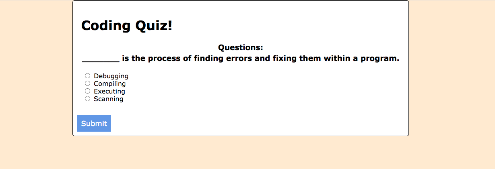
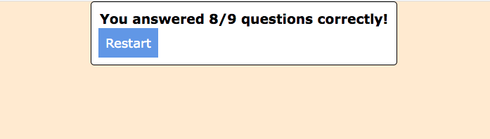

# Coding-Quiz-JS

A very brief 9 question coding quiz.

The quiz keeps track of your score and is presented at the end. 

The timer is missing, and the high score page needs to be added.

GitHub Repo: https://github.com/YourFunkyDad/Coding-Quiz-JS

Deployed: https://yourfunkydad.github.io/Coding-Quiz-JS/

